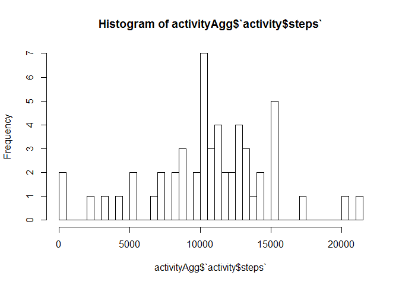
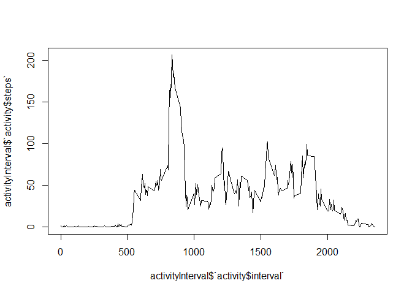

# Reproducible Research: Peer Assessment 1


## Loading and preprocessing the data


```r
data <- unzip(zipfile = "activity.zip")
activity <- read.csv(data)
activity <- activity[complete.cases(activity),] 
```


## What is mean total number of steps taken per day?

```r
head(activity)
```

```
##     steps       date interval
## 289     0 2012-10-02        0
## 290     0 2012-10-02        5
## 291     0 2012-10-02       10
## 292     0 2012-10-02       15
## 293     0 2012-10-02       20
## 294     0 2012-10-02       25
```

```r
activityAgg <- aggregate(activity$steps~activity$date, activity,sum)
hist(x = activityAgg$`activity$steps`)
```

<!-- -->

```r
activityAggMean <- mean(activityAgg$`activity$steps`)
cat("Daily mean steps are: " , activityAggMean )
```

```
## Daily mean steps are:  10766.19
```

```r
activityMedian <- median(activityAgg$`activity$steps`)
cat("Daily median steps are: " , activityMedian)
```

```
## Daily median steps are:  10765
```

## What is the average daily activity pattern?

```r
activityInterval <- aggregate(activity$steps~activity$interval,activity,mean)
plot(y=activityInterval$`activity$steps`, 
     x=activityInterval$`activity$interval`,type = "l")
```

<!-- -->

```r
activityIntervalMax <- max(activityInterval$`activity$steps`)

#activityIntervalMaxInterval <- max(activityInterval$`activity$steps`~ activityInterval$`activity$interval`)

# Find the row of maximum steps

maxInterval <- activityInterval[which.max(activityInterval$`activity$steps`),]$`activity$interval`

cat("Maximum number of averaged steps are ", activityIntervalMax , "in interval ", maxInterval)
```

```
## Maximum number of averaged steps are  206.1698 in interval  835
```


## Imputing missing values


## Are there differences in activity patterns between weekdays and weekends?
