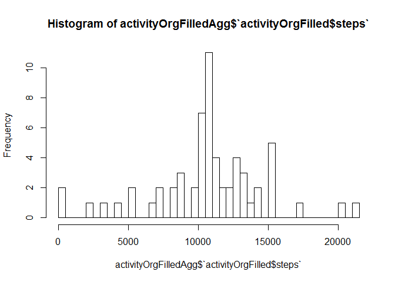
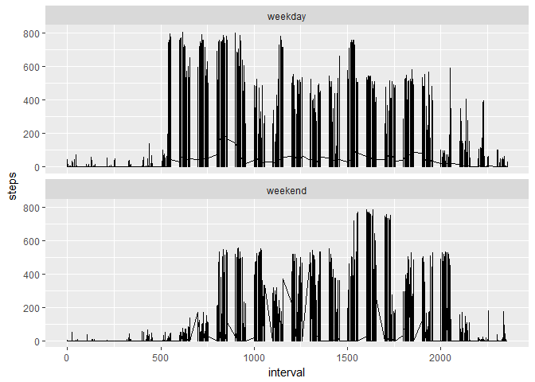
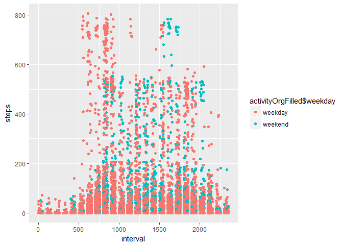

# Reproducible Research: Peer Assessment 1


## Loading and preprocessing the data


```r
data <- unzip(zipfile = "activity.zip")
activity <- read.csv(data)
activity <- activity[complete.cases(activity),] 
```


## What is mean total number of steps taken per day?

```r
head(activity)
```

```
##     steps       date interval
## 289     0 2012-10-02        0
## 290     0 2012-10-02        5
## 291     0 2012-10-02       10
## 292     0 2012-10-02       15
## 293     0 2012-10-02       20
## 294     0 2012-10-02       25
```

```r
activityAgg <- aggregate(activity$steps~activity$date, activity,sum)
hist(x = activityAgg$`activity$steps` , breaks=50)
```

<!-- -->

```r
activityAggMean <- mean(activityAgg$`activity$steps`)
cat("Daily mean steps are: " , activityAggMean )
```

```
## Daily mean steps are:  10766.19
```

```r
activityMedian <- median(activityAgg$`activity$steps`)
cat("Daily median steps are: " , activityMedian)
```

```
## Daily median steps are:  10765
```

## What is the average daily activity pattern?

```r
activityInterval <- aggregate(activity$steps~activity$interval,activity,mean)
plot(y=activityInterval$`activity$steps`, 
     x=activityInterval$`activity$interval`,type = "l")
```

<!-- -->

```r
activityIntervalMax <- max(activityInterval$`activity$steps`)

# Find the row of maximum steps
maxInterval <- activityInterval[which.max(activityInterval$`activity$steps`),]$`activity$interval`
cat("Maximum number of averaged steps are ", activityIntervalMax , "in interval ", maxInterval)
```

```
## Maximum number of averaged steps are  206.1698 in interval  835
```


## Imputing missing values


```r
activityOrg <- read.csv(data)
totalMissing <- sum(is.na(activityOrg$steps))
totalMissing
```

```
## [1] 2304
```

```r
cat("total number of missing step values from a original dataset is " , totalMissing)
```

```
## total number of missing step values from a original dataset is  2304
```

```r
naRows <- which(is.na(activityOrg$steps))

# Create a new data frame for filling NA values
activityOrgFilled <- activityOrg

# Loop for NA and find the interval to replace with
for(i in 1:nrow(activityOrgFilled))
  {
    if (is.na(activityOrgFilled$steps[i])) 
    {
      activityOrgFilled$steps[i] <- activityInterval[activityOrgFilled$interval[i]==activityInterval$`activity$interval`,]$`activity$steps`
    }
}

# Is there any NA fileds in new data frame activityOrgFilled?
naRows2 <- sum(is.na(activityOrgFilled$steps))
cat("With filled in mean intervals there are " , naRows2 , " NA fields")
```

```
## With filled in mean intervals there are  0  NA fields
```

```r
# Make a histogram of the total number of steps taken each day
activityOrgFilledAgg <- aggregate(activityOrgFilled$steps~activityOrgFilled$date, activityOrgFilled,sum)

hist(x = activityOrgFilledAgg$`activityOrgFilled$steps`, breaks=50)
```

<!-- -->

```r
# Report
# Mean
activityOrgFilledAggMean <- mean(activityOrgFilledAgg$`activityOrgFilled$steps`)
cat("Daily mean steps are: " , activityOrgFilledAggMean )
```

```
## Daily mean steps are:  10766.19
```

```r
# Median
activityOrgFilledAggMedian <- median(activityOrgFilledAgg$`activityOrgFilled$steps`)
cat("Daily median steps are: " , activityOrgFilledAggMedian)
```

```
## Daily median steps are:  10766.19
```

```r
cat("We can see that median and mean are  the same as without filled in data, so our filled in mean data did not have impact on overall dataset. Good job!")
```

```
## We can see that median and mean are  the same as without filled in data, so our filled in mean data did not have impact on overall dataset. Good job!
```

## Are there differences in activity patterns between weekdays and weekends?

```r
# Create a new factor variable in the dataset with two levels -- "weekday" and "weekend" 

activityOrgFilled$weekday <- as.factor(weekdays(as.Date(activityOrgFilled$date)))
activityOrgFilled$weekday <- ifelse(weekdays(as.Date(activityOrgFilled$date)) %in% c("subota", "nedjelja"), "weekend", "weekday")

activityOrgFilled$weekday <- as.factor(activityOrgFilled$weekday)

# Plot by facors for weekdays and weekends

library(ggplot2)
p <- ggplot(data=activityOrgFilled , aes(x=interval,y=steps)) 
p <- p + geom_line()
p <- p + scale_fill_brewer(palette="Set1")
p <- p + facet_wrap(~weekday ,ncol=1)
p
```

<!-- -->

```r
qplot(
  x=interval,
  y=steps,
  data = activityOrgFilled,
  color=activityOrgFilled$weekday
)
```

<!-- -->

```r
cat("We can see differences in activity in weekdays and weekends.")
```

```
## We can see differences in activity in weekdays and weekends.
```
